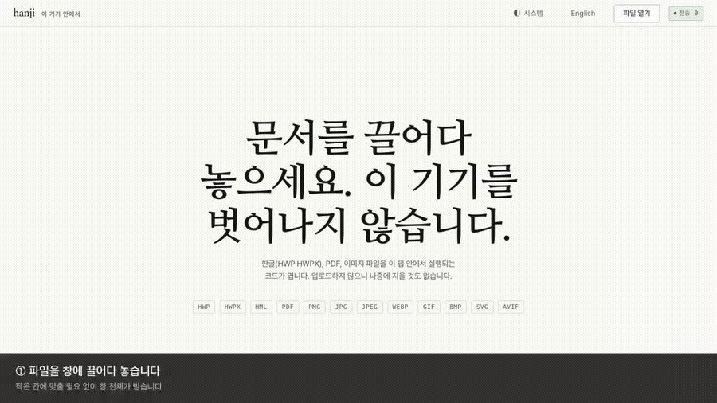

# hanji

*[한국어](README.md) — the primary README. This is the translation.*

Open, convert, print and lightly edit Hangul (HWP/HWPX), PDF and image files **entirely on your own
device** — as a desktop app for Windows and macOS, or straight from a browser tab.

Every other online converter uploads your file and then promises to delete it. This one has
nothing to delete, because nothing is sent. The app ships a badge that counts outbound requests
in real time so the claim is visible rather than asserted, and the end-to-end test fails the
build if a single foreign request appears.

> Status: early. Viewing, conversion and printing work. See the roadmap below.

## Install

| | |
|---|---|
| **Windows** | Download `-setup.exe` from [Releases](../../releases) and run it |
| **macOS** | Download `-universal.dmg` from [Releases](../../releases), drag to Applications, then **right-click → Open on first launch only** |
| **Browser** | An install-free web build is coming; same features, address not public yet |

macOS builds are unsigned — an Apple Developer certificate is $99/year and this is a free tool, so
the first launch needs right-click → Open. Windows shows a SmartScreen notice for the same reason.
Both are documented rather than hidden, because a scary dialog on first run is exactly the moment a
privacy tool loses trust.

**Using it is one gesture: drag a file onto the window.** The whole window is the target — there is
no small box to aim at. Print and conversion buttons appear above the document once it opens.



That clip is generated by [`demo-record.py`](demo-record.py), not hand-recorded. It drives the real
app through a real `DataTransfer` drop and a real conversion, so if drag-and-drop or HWPX export ever
breaks, the demo breaks with it instead of continuing to advertise a feature that stopped working.

### Printing

Paper is where a public-sector document usually ends up: it gets signed, stamped or filed, and all
three happen on a printed copy. A Hangul viewer without print leaves that last step to some other
program.

What is on screen is what reaches the sheet. The toolbar, the status line and the badge do not
print. One document page lands on one sheet, and the last sheet is not followed by a blank one.
The test prints for real and counts the pages that come out, so the classic failure — a single
sheet showing whatever was scrolled into view — fails the build.

The desktop build does not use `window.print()`. Inside a packaged web view on macOS that call can
return having done nothing, and a print button that silently does nothing is worse than none,
because the user concludes the document is at fault. The shell drives the platform's own print
operation instead.

## Why

Korean document folders are a mix of HWP, PDF and images, and no single no-upload tool handles
all three. The excellent client-side tools that exist are each single-format: Squoosh for images,
BentoPDF and PDFCraft for PDF, rhwp for Hangul. Meanwhile Korean public bodies were required from
2026-05-18 to move to open document formats (HWPX/ODF/PDF-A), which makes Hangul-format tooling
newly relevant to a lot of people who never thought about it before.

## What works today

| | |
|---|---|
| View | HWP, HWPX, HML, PDF, images, video (MP4/MOV/WebM) |
| Print | Hangul documents, PDF, images |
| Convert | HWP ↔ HWPX ↔ HML · Hangul → PDF / PNG · PDF → PNG / JPEG · image → PNG / JPEG / WebP |
| Edit | PDF split, rotate, keep-a-page-range, merge |
| Make | video → stills or GIF · images → GIF or PDF |

Drop several files at once and the app switches from "what is in this document" to "make one thing
out of these": merge the PDFs, or turn the photos into a GIF or a PDF. Order comes from the
filenames rather than from the drag, because a multi-file drop hands over whatever order the
operating system felt like and the user cannot see it.

GIF export offers named presets — slideshow, boomerang, play-once, held cover, chat-sized — rather
than one plain concatenation. Pressing one converts immediately at that setting.

**HWP → HWPX is the one worth calling out.** Korean public bodies were required from 2026-05-18 to
move to open document formats, and HWPX is the open one. The engine exports it natively, so the
output is a real HWPX package rather than a re-render — and unlike every other converter that does
this, your file never leaves the tab. The test suite converts a document, reopens the result and
checks its page geometry survived.

Multi-page exports arrive as a `.zip`, written by a small store-only ZIP writer. Everything going
in is already-compressed PNG or JPEG, so deflate would cost CPU and save nothing.

PDF export rasterises each page, which means the text in it is not selectable or searchable. The
button says so before you click. A vector path would need Korean fonts embedded in the PDF; that
is a real piece of work and is on the roadmap rather than pretended away.

Measured on a real 2-page Korean civil-service exam paper: HWP parsed in ~50 ms cold, ~5 ms warm.
Initial page weight is under 5 kB gzipped; every engine is a dynamic import that only downloads
when you actually open a file of that kind.

## Hangul fidelity

Two-column Hangul documents used to render badly here. Both causes are now identified.

The first was ours: `@rhwp/core` requires the page to provide a `globalThis.measureTextWidth`
callback, because WASM cannot see browser fonts and needs it to decide line breaks. We had not
installed it, so text was mismeasured and columns overran. Fixed.

The second is an upstream regression, bisected to rhwp commit `10c36e23` (first shipped in
v0.7.6): a block-level table preceded by tabs is displaced by the tab width, pushing boxed
passages out of their column. It reproduces in rhwp's own CLI with no browser involved.

Every published `@rhwp/core` since 0.7.6 has it, so there is no version to pin to. We build the
engine ourselves with a one-file patch — see [vendor/README.md](vendor/README.md) for provenance
and rebuild steps, and [docs/DECISIONS.md](docs/DECISIONS.md) for the bisect and measurements.
Upstream's own test suite passes 2933/2933 with the patch applied.

`e2e-smoke.py` asserts that no table exceeds the page width, so a regression fails the build rather
than quietly rendering a wrong-looking page. That check measures only painted rectangles: the
engine emits a body clip path wider than the sheet, and counting rectangles inside `<defs>` reported
an overflow no reader could see.

We have no Hancom reference renderer, so "correct" here means *matches rhwp before the regression
and stays inside the page*. Building a real fidelity corpus for Hangul documents is on the roadmap.

## How to check that nothing is sent

Do not take it on trust. There are three ways.

**Watch the badge.** Top right of the window is a count of requests that left the origin. It should
stay at zero the whole time you use it. That is an instrument, not a slogan: it wraps `fetch`,
`XMLHttpRequest` and the beacon API and counts what passes through.

**Read the dependency list.** [`src-tauri/Cargo.toml`](src-tauri/Cargo.toml) contains no HTTP
client. The strongest form of "your file does not leave" is a binary with nothing in it that could
send one. It is short enough to read in full.

**Pull the network cable.** After installation the app works with no network at all.

The test suite does not trust the badge either. It records every request the browser makes and
fails if one of them leaves our origin.

## Desktop

The desktop app is a [Tauri v2](https://tauri.app) shell around the same bundle the website serves.
Not a port: every parser, renderer and encoder is byte-identical, because they were always running
locally. Only the shell differs.

That shell is deliberately almost empty. `src-tauri/` is around 40 lines of Rust, and the dependency
list has no HTTP client in it at all. It owns exactly three things the browser cannot do for itself:
a native Save panel, writing the bytes it chose, and driving the system print dialog.

Three things genuinely differ between a browser tab and a native window, and each needed real work
rather than a shim:

**Drag and drop.** Tauri's webview intercepts file drops before the page sees them, so the HTML5
`drop` event never fires and the app's single most important gesture silently does nothing. Fixed by
turning the interception off (`dragDropEnabled: false`) so one code path serves both shells.

**Saving.** The web build writes files with a blob URL and a synthetic anchor click. macOS WKWebView
has no download manager for that to talk to, so desktop goes through a native Save panel instead.
That panel introduces a state the browser does not have — **cancel** — so `saveBlob` now reports
whether bytes were actually written. Claiming "saved" over a dismissed dialog would be a small lie
told at precisely the moment someone is checking whether the tool does what it claims.

**Capabilities.** The window can put up a Save panel and write inside `$HOME`. That is the entire
permission set ([`src-tauri/capabilities/default.json`](src-tauri/capabilities/default.json)) — no
network, no shell, no arbitrary filesystem. Anything absent from that file is unreachable from the
front end even if a dependency tried.

Windows and macOS bundles cannot cross-compile, so
[`.github/workflows/release.yml`](.github/workflows/release.yml) builds each on its own runner. macOS
ships one universal binary rather than separate Intel and Apple Silicon downloads, so nobody has to
know which Mac they own.

## Security

Four questions, each answered by the tool that is the ordinary answer to it: are there secrets in
the history, are the dependencies known-vulnerable, does the code contain a known-bad pattern, and
is anything shipping under a licence that changes what this project may be.

```bash
tools/security-scan.sh          # everything installed locally
tools/security-scan.sh deps     # one section
```

CI runs gitleaks, npm audit, cargo audit, osv-scanner, CodeQL and semgrep
([`.github/workflows/security.yml`](.github/workflows/security.yml)), on a weekly schedule as well
as on commits. Dependencies do not become vulnerable when you edit them; they become vulnerable
when somebody publishes the finding.

It has already paid for itself. pdf.js releases 5.6.83 through 6.2.107 carried an
**arbitrary-JavaScript-execution flaw reachable by opening a crafted file**
(GHSA-hq66-cqwq-w95j), which for a document viewer is the entire threat model. The dependency audit
caught it; the engine is now on 6.2.108.

## Licensing

hanji's own source is MIT. The distribution also contains components under other licences: pdf.js
is Apache-2.0, the Noto fonts are under the SIL Open Font License, and five crates pulled in by
Tauri are MPL-2.0. "hanji is MIT" describes this repository, not everything inside the installer.

The full inventory with licence texts is in
[THIRD_PARTY_LICENSES.md](THIRD_PARTY_LICENSES.md), generated from what is actually installed rather
than maintained by hand.

```bash
python3 tools/license-report.py            # regenerate the notice file
python3 tools/license-report.py --check    # fail on a licence that needs a decision
```

MPL-2.0 is per-file copyleft: it permits distribution inside a larger work under other terms,
provided the covered files keep their licence and their source stays available. All five are used
unmodified as published, and the notice file says where to get them.

`--check` does not fail on MPL. Failing a build over something that only needs documenting teaches
everyone to skip the check. It fails on licences that would change what this project may be — GPL,
AGPL and the source-available terms. There are none.

## Develop

```bash
npm install
npm run dev            # web, http://localhost:5173
npm run build          # typecheck + production build
npm run desktop:dev    # native window, hot-reloads the same frontend
npm run desktop:build  # .dmg / .exe into src-tauri/target/release/bundle
```

The desktop build needs a [Rust toolchain](https://rustup.rs); the web build does not.

The end-to-end suite drives a real Chromium against the production build and asserts on what
appears on screen — including the zero-egress claim, which it verifies itself by recording every
request rather than trusting the badge's own count. Point it at any two documents you have:

```bash
export HANJI_FIXTURE_HWP=/path/to/any.hwp
export HANJI_FIXTURE_PDF=/path/to/any.pdf
npm run preview &      # HANJI_URL overrides the address if :4173 is taken
python3 e2e-smoke.py
```

Fixtures are supplied rather than committed. Page counts are read off whatever you provide instead
of being hard-coded, so "one PNG per page" is checked against the pages that actually rendered.

The dev server sets the same COOP/COEP headers as production so cross-origin-isolation problems
surface locally instead of after deploy.

## Deploy

Cloudflare Pages. Build command `npm run build`, output directory `dist`. The `public/_headers`
file carries the CSP and the COOP/COEP configuration.

```bash
npx wrangler pages deploy dist --project-name hanji
```

**Why not GitHub Pages?** Not for the reason you would expect. The app runs fine with no response
headers at all — nothing here uses threads, so cross-origin isolation is irrelevant (measured; see
[docs/DECISIONS.md](docs/DECISIONS.md) D1). It comes down to bandwidth and framing: opening a
Hangul document transfers roughly 6 MB, so a 100 GB/month tier is ~17,000 sessions, and without a
real CSP header we lose `frame-ancestors`, which lets anyone embed this tool inside a page that
claims to upload your file. Cloudflare Pages meters neither and sends both.

## Roadmap

- [x] Viewer: HWP/HWPX, PDF, images
- [x] Network-zero badge with a test that enforces it
- [x] Convert: HWP ↔ HWPX ↔ HML, Hangul → PDF/PNG, PDF → image, image → image
- [x] Edit: PDF split, rotate, page-range extract, merge
- [x] Video → stills / GIF, and images → GIF / PDF, without shipping a codec
- [x] Printing
- [x] Desktop app for Windows and macOS
- [ ] HEIC → JPEG (iPhone photos; needs a lazily-loaded decoder, no browser ships one)
- [ ] Vector PDF export, so exported text stays selectable
- [ ] Reordering pages, which unlike the rest genuinely needs a page-picker UI
- [ ] Hangul text edits with re-save
- [ ] Fidelity corpus of real Hangul documents — no baseline exists for this ecosystem
- [ ] PWA / full offline

Out of scope for v1: Office (docx/pptx) conversion, which has no clean client-side path; video and
audio encoding, pending a real measurement of ffmpeg.wasm's cost.

## Language

Korean by default, with an English toggle in the header, and the Korean README is the primary one.
The default is unconditional rather than sniffed from `navigator.language`: this tool exists for
Korean documents, and someone arriving with an English-locale browser is more likely to be a Korean
user on an English machine than an English speaker holding an HWP file. Guessing wrong in that
direction hides the product from the people it was built for. The choice persists, and switching
re-opens the current document rather than reloading the page.

## Theme

Three states — system, light, dark — not two. A binary toggle overrides the OS preference forever
after one accidental click with no way back to "just follow my machine", which is what most people
want. The choice persists, and an explicit choice wins in *both* directions, including dark on a
light OS, which `prefers-color-scheme` alone cannot express.

The saved theme is applied by a separate same-origin script in `<head>` rather than by the module
bundle, so nobody gets a flash of the wrong palette on load. It is a file rather than an inline
`<script>` because the CSP pins `script-src` to `'self'`.

Document pages stay on white paper in dark mode. The page is the user's content, and recolouring it
would misrepresent the document — the same choice Preview and Acrobat make.

## Responsive

Verified at 320, 375, 768, 1024 and 1440 with real touch emulation: no horizontal scroll at any
width, and every control clears 44px where the pointer is actually a finger. The desktop toolbar
stays deliberately dense — the size only grows under `(pointer: coarse)`.

The header wraps rather than sitting in a fixed-height row. Raising touch targets to 44px made the
controls stop fitting one line at 320px and forced a 37px overflow; wrapping fixes the cause instead
of shrinking the targets back.

## Why there is no ffmpeg in here

Extracting a still and building a short GIF are the two things people ask a video tool for without
wanting a video tool, and neither needs a codec of our own. A `<video>` element drawn onto a canvas
gets frames out of anything the platform can already play, which is MP4/H.264 and WebM everywhere
this app runs. GIF encoding is `gifenc`, about 10 kB gzipped and lazily imported.

Bundling ffmpeg was the obvious alternative and was rejected on measurement. The app is 9.3 MB; a
static ffmpeg is 70 to 90 MB, so it would have been roughly ten times the entire product. The
common builds are configured `--enable-gpl --enable-libx264`, which does not make MIT code GPL but
does put GPL obligations on the distributed bundle, and whether a tightly integrated sidecar counts
as mere aggregation is contested ground a solo maintainer should not volunteer for. And a project
whose central claim is "read the dependency list, there is no network client in it" does not want
to answer for several hundred container and codec parsers.

The honest cost of the choice: exotic codecs will not open, and there is no trimming, no
re-encoding, no audio. That is a video editor's job and this is not one.

## Korean typography

Browsers treat Hangul like Chinese and Japanese and will break a line between any two syllables, so
the headline shipped reading `문서를 끌어다 놓으세 / 요.` — a word split down the middle on the
product's first screen. `:lang(ko) { word-break: keep-all }` restricts breaks to spaces, which is how
Korean is actually set. Paired with `overflow-wrap: break-word` so a long unspaced token (a file name
in the status line) still wraps instead of overflowing.

## Accessibility

Keyboard order is Open → print → each conversion → the file input, every control is a real
`<button>` with a visible focus ring, the status line is an `aria-live` region, and focus returns to
the button you pressed after a conversion finishes rather than being dropped on `<body>`. Motion
respects `prefers-reduced-motion`.

## Licence

MIT for this repository. Built on [rhwp](https://github.com/edwardkim/rhwp) (MIT, patched),
[pdf.js](https://github.com/mozilla/pdf.js) (Apache-2.0) and
[pdf-lib](https://github.com/Hopding/pdf-lib) (MIT). Full third-party inventory in
[THIRD_PARTY_LICENSES.md](THIRD_PARTY_LICENSES.md).
